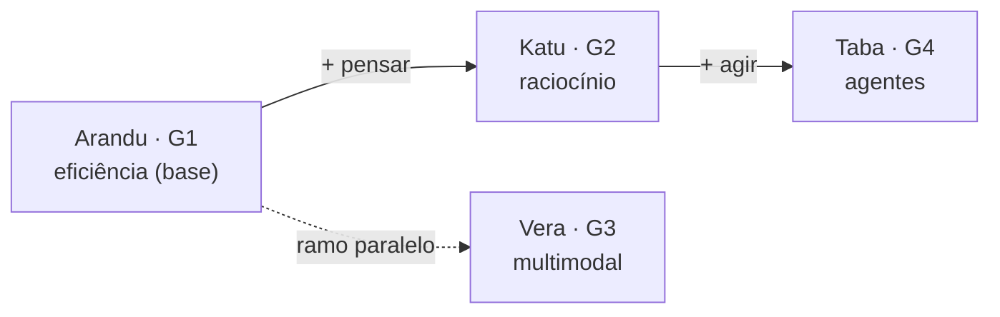

# Rendeia — Plano para o futuro

Visão de onde o projeto está e para onde vai. Documento **vivo** — atualizar
conforme as coisas acontecem. Para nomenclatura e o roadmap curto, ver
[ROADMAP.md](ROADMAP.md); para a doc técnica, [PLANO.md](PLANO.md).

_Criado em 2026-07-09._

---

## 1. Onde estamos hoje

| Área | Estado |
|---|---|
| **Modelo padrão** | **Arandu Mirim 1.2** — fine-tune pt-BR sobre Qwen3-1.7B, promovido a padrão |
| Dataset de treino | 282 exemplos (era ~40), com validador; system alinhado ao de produção |
| Publicação | GitHub (`rendeia/Arandu`) + Hugging Face (`rendeia/Arandu-Mirim-1.2-GGUF`) |
| Interface | Seletor de modelo no chat; multilíngue; voz; memória; RAG |
| **Ações assistidas** | Código completo (criar evento / rascunhar e-mail, com card de confirmação) — falta o teste ponta a ponta com Outlook |
| Família Katu (G2) | **Katu Mirim 2.1** (CPU/pendrive, DeepSeek-R1-Distill-1.5B, raciocínio real) integrada ao chat; edição WebGPU 2.0 vira demo |

**Princípio que guia tudo:** IA em português, **100% offline, na CPU, do
pendrive**, com privacidade real. Cada decisão respeita RAM baixa, velocidade e
o "clica e roda". O foco estratégico é o **tier Mirim bem-acabado** — Eté/Guaçu
e as famílias Vera/Taba dependem de hardware acima do alvo.

---

## 2. Curto prazo (semanas)

- [ ] **Testar as ações assistidas ponta a ponta** (Windows + Outlook clássico):
      criar evento, rascunhar e-mail, conferir destino. É o que falta para a
      Frente B fechar de verdade.
- [ ] **Publicar os Releases** no GitHub (`.zip` Nano + instalador Desktop). Hoje
      o README aponta para `releases/latest`, mas o pacote ainda não foi solto —
      e o futuro **portal** depende disso para os downloads.
- [ ] **Abrir/mesclar o PR** de `docs/plano-1.2-acoes` → `main`.
- [ ] (Opcional) **imatrix pt-BR sobre a 1.2** — acabamento incremental; exige
      re-exportar a 1.2 em Q8_0 e rodar `llama-imatrix`/`llama-quantize`
      (ver [treino/imatrix/README.md](../treino/imatrix/README.md)).

## 3. Médio prazo (meses)

- [ ] **Portal `rendeia.com`** (ver seção 5) — hub de download + demo + docs.
- [ ] **Ampliar mais o dataset** e, quando valer a pena, uma próxima iteração do
      Mirim (mantendo a política de versão: número só muda ao promover um padrão).
      Alvo natural de melhoria: o "mais/mas" (limite atual do 1.7B) e mais
      cobertura de tarefas reais coletadas do uso.
- [ ] **Mais ações assistidas** — além de evento/e-mail: confirmar limpeza de
      arquivos (a rota destrutiva ficou deliberadamente de fora até uma decisão
      explícita), lembretes, etc. Sempre com o padrão "propõe → confirma → executa".
- [ ] **Voz de entrada (STT offline)** — falar com a IA (whisperfile), fechando o
      ciclo de conversa por voz.

## 4. Longo prazo (depende de hardware / pesquisa)

- [ ] Tiers **Eté** (~3B) e **Guaçu** (~7B) — quando houver hardware acima do alvo.
- [ ] Família **Vera** (G3, multimodal/visão) e **Taba** (G4, agentes) — conceito.
- [ ] Levar a experiência WebGPU (hoje na Katu) para mais modelos — "experimente
      no navegador, sem instalar".

---

## 5. Portal rendeia.com

**Objetivo:** um endereço único que apresente a Rendeia, sirva de **hub de
download** e mostre um **demo ao vivo**. Unifica GitHub + Hugging Face + pacotes.

**O que a página deve ter:**
- Hero com a proposta (offline, pt-BR, CPU, pendrive, privacidade).
- **Downloads:** Nano (`.zip`), Desktop (instalador) e o GGUF — **linkando** para
  GitHub Releases e Hugging Face (o site NÃO hospeda os binários grandes).
- **Famílias** Arandu/Katu/Vera/Taba (diagrama).
- **Demo ao vivo:** o Space da Katu (WebGPU) — "experimente agora, sem instalar".
- Links de docs (manual, model card do HF, GitHub).

**Tecnologia (respeitando o espírito leve do projeto):**
- Site **estático** (HTML/CSS, sem framework pesado).
- Hospedagem: **GitHub Pages** (grátis, domínio próprio) — repo `rendeia.github.io`.
  Alternativas: Cloudflare Pages, Netlify, Space estático no HF.
- Domínio: registrar `rendeia.com` (~R$ 50/ano) e apontar para o Pages.

**Pré-requisito:** publicar os **Releases** primeiro (senão os downloads apontam
para o vazio).

**Caveats honestos:** custo do domínio + manutenção mínima; binários grandes
sempre em Releases/HF, nunca no site.

---

## 6. Fluxo de evolução das famílias (o norte)

Cada família empurra o **seu** eixo — sem invadir o do vizinho. A numeração
G1→G4 reflete uma dependência real: agentes (Taba) precisam de raciocínio
(Katu), que roda sobre a base eficiente (Arandu). Vera (multimodal) é um ramo
paralelo, mais pesado.

**Fidelidade dos eixos hoje:** Arandu ✅ eficiência (CPU, `/no_think`, Q4_K_M);
Katu ✅ raciocínio **de verdade** na edição CPU **2.1** (DeepSeek-R1-Distill-1.5B,
pensa com `<think>` nativo — a 2.0 WebGPU rodava Llama-3B, geral); Vera/Taba ⚪ conceito.

**Regra anti-borrão:** as ações assistidas de hoje vivem no Arandu, mas são a
*semente* da Taba. No Arandu, ação = **um passo, sempre confirmado**
(conveniência). Agência profunda (planejar + encadear ferramentas sozinho) é o
que define a Taba.

### O que isso significa para codificar

- **Arandu (agora):** manter a eficiência + o Mirim afiado. Ações **finas e
  confirmadas** — não deixar virar agente. Métrica: qualidade por MB, tok/s.
- **Katu (próximo investimento):** aprofundar raciocínio — é a **ponte para a
  Taba**. Investir aqui paga duas famílias.
- **Taba (quando chegar):** não começar do zero — juntar *raciocínio da Katu
  (planejar)* + *infra de ações do Arandu (executar)*.
- **Vera:** experimental até um VLM pequeno caber no alvo.

**Teste de fidelidade** (por família, antes de adicionar algo):
- Arandu: *"isso me deixa mais rápido/leve, ou só mais capaz?"*
- Katu: *"isso melhora o raciocínio, ou é só velocidade?"*
- Taba: *"é um passo único confirmado (Arandu), ou o modelo planejando sozinho (Taba)?"*

## 7. Princípios (o que NÃO abrir mão)

1. **Offline e privado** — nada sai da máquina do usuário.
2. **Leve** — roda na CPU, RAM baixa, cabe no pendrive.
3. **Honestidade** — o modelo diz "não sei"; a doc admite limitações; ações só
   executam após confirmação.
4. **Versão só ao promover** — iterações ficam num candidato; o número não infla
   a cada teste.
5. **Foco no Mirim** — acabar bem o que cabe no hardware antes de sonhar grande.
